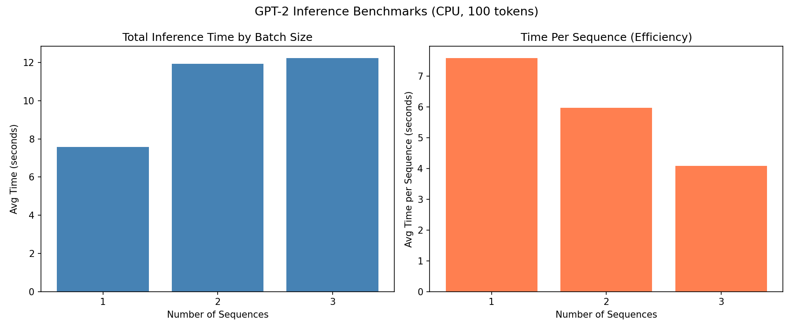

# llm-batch-inference-benchmark
This project benchmarks GPT-2's inference latency and how this model's performance and efficiency is affected by differences in batch sizes.
## What it does
The script has GPT-2 generate text given a prompt in batch sizes of 1, 2, and 3 on CPU, running each setup 3 times and calculating the averages to mitigate the effect of potential outliers.
## Results

| Batch Size | Avg Time per Batch (s) | Avg Time per Sequence (s) |
|---|---|---|
| 1 | 7.58 | 7.58 |
| 2 | 11.93 | 5.96 |
| 3 | 12.23 | 4.08 |
## Analysis
I ran GPT2 generating responses to a prompt and measured its efficiency based on how many sequences are in a single batch. The prompt was "The future of brain computer interface is," although the prompt itself is irrelevant. I ran the batches in sequences of 1, 2 and 3 and the average times per sequence respectively are about 7.58, 5.96, and 4.08. Interestingly, the average time of each sequence decreased each batch with the 3rd batch having the shortest average time per sequence which is likely due to the overhead process being spread among each sequence rather than all in one sequence with the generation time being similar to a formula of overhead + (generation_time * num_sequences). 
This shows that performing inference operations with LLMs in larger batches has the potential to be significantly more efficient than performing operations/ sequences one at a time. 
## Why it matters
The increase of efficiency of batching that has been demonstrated on CPU is much more significant when done on GPU. This principle is a basis of systems made to improve LLMs like vLLM, continuous batching to maximize the production of utilizing GPUs across simultaneous requests.  
## Tools
Python, HuggingFace Transformers, NumPy, Matplotlib
